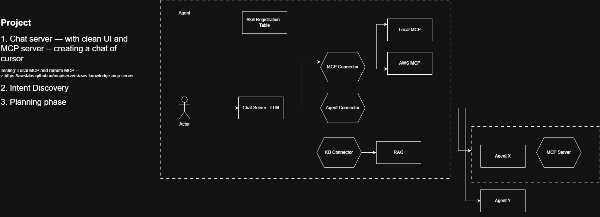
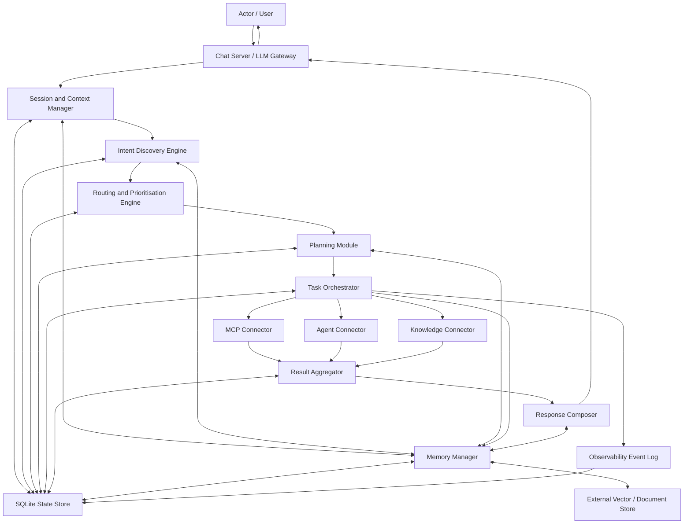
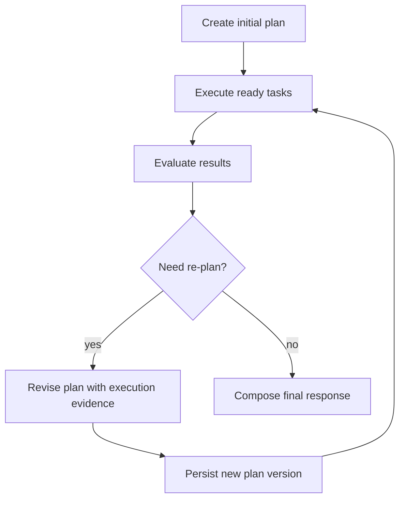
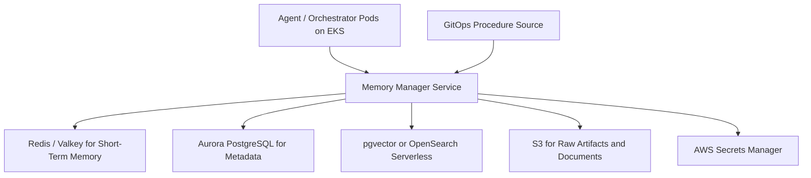
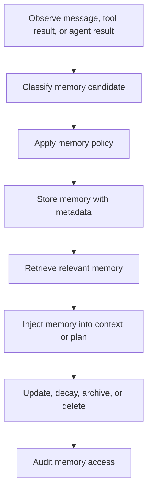
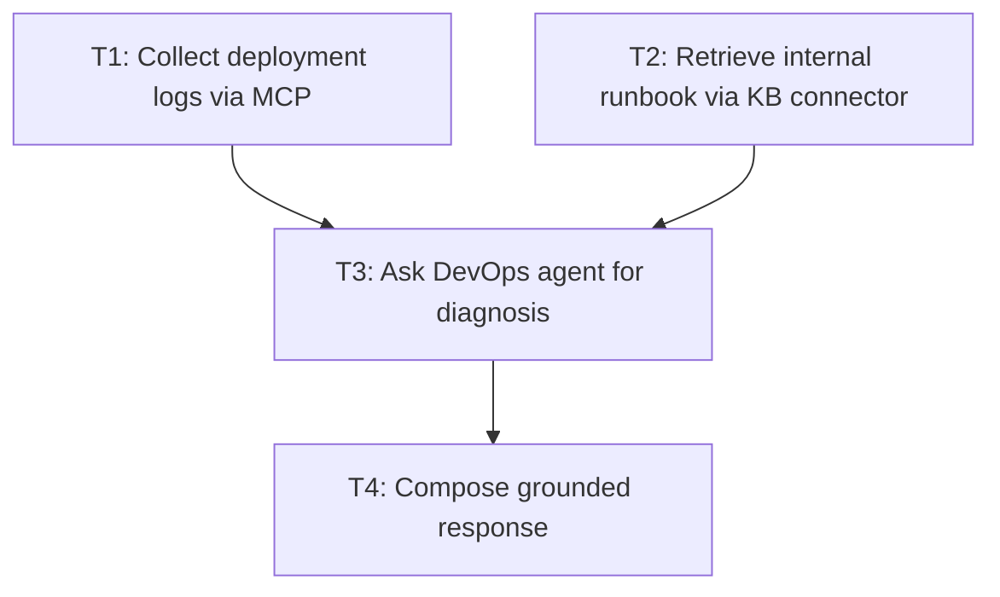

# Project Guide: Multi-Agent Orchestration Architecture

This project guide converts the multi-agent orchestration architecture notes into
a practical build plan for a chat-first Agentic AI platform. The goal is to move
from a simple prompt-forwarding chatbot to an inspectable orchestration layer
that can discover user intent, plan work, route tasks across MCP servers and
specialist agents, retrieve knowledge, track state, and return grounded answers.



## 1. Project Objective

Build a production-oriented multi-agent orchestration system where the chat
interface is only the entry point. The real work happens in explicit modules:

- Session and context management
- Intent discovery
- Routing and prioritisation
- Planning
- Task orchestration
- MCP and agent execution
- Knowledge retrieval
- Result aggregation
- Response composition
- Memory management
- Policy enforcement
- Observability and audit tracking

The system should not simply send the user's prompt to a model and hope the
model decides the right actions. It should convert the user request into a
traceable execution plan, execute that plan through controlled backends, and
compose the final response from actual results.

## 2. Core Principles

1. Treat intent discovery as multi-label classification.
   A user request may require retrieval, tool execution, delegation, planning,
   summarisation, and clarification at the same time.

2. Separate conversation from orchestration.
   The chat server receives messages and returns responses. Planning, tool use,
   task state, policy checks, and result aggregation belong to the orchestration
   layer.

3. Persist orchestration state.
   Sessions, messages, intents, plans, tasks, dependencies, handoffs, tool calls,
   retrieval operations, memories, policies, and events should be traceable.

4. Use SQLite for orchestration metadata in the first version.
   SQLite is appropriate for sessions, plans, task state, and event history. It
   should not be used for large documents, binary artifacts, or vector indexes.

5. Make planning machine-usable.
   A plan should be a structured JSON contract with task identifiers,
   dependencies, executors, constraints, fallbacks, and success criteria.

6. Prefer evidence before reasoning.
   Read-only evidence collection should usually happen before delegating to a
   specialist agent for diagnosis or remediation strategy.

7. Make every meaningful action observable.
   Multi-agent systems are difficult to debug without event logs, correlation
   IDs, task state transitions, latency metrics, and execution artifacts.

8. Treat memory as a governed subsystem.
   Short-term memory, long-term memory, episodic memory, reflective memory, and
   procedural memory should have different storage, retrieval, retention, and
   trust rules.

## 3. Target Architecture

The target system is a chat-driven control plane that sits between the user and
multiple execution backends.



## 4. Missing Control Plane Components

The architecture sketch identifies the major integration points, but a complete
multi-agent system also needs the following orchestration blocks.

| Component | Why It Is Needed | Responsibilities |
|-----------|------------------|------------------|
| Session and context manager | Routing requires stable conversational state | Conversation history, active user context, memory references, execution constraints |
| Intent discovery engine | A request can contain multiple intents | Candidate intents, entities, constraints, confidence scores |
| Routing and prioritisation engine | The system must decide order, parallelism, and blocked routes | Score intents/tasks by confidence, urgency, dependency, cost, risk, and policy |
| Planning module | Execution must be explicit and inspectable | Task graph, dependencies, fallback routes, success criteria |
| Memory manager | Agents need controlled continuity across sessions and tasks | Short-term state, semantic memories, episodes, reflections, procedures, retrieval policy |
| Policy and guardrail engine | Some routes require approval or must be blocked | Privacy, local-first rules, safety checks, budgets, approval gates |
| State store | Coordination becomes opaque without persisted metadata | Sessions, messages, plans, tasks, tool calls, handoffs, outcomes |
| Observability and event log | Multi-agent debugging requires traces | Events, latencies, errors, retries, route quality, operator audit trail |

## 5. End-to-End Execution Flow

### Step 1: Intake

When a message arrives:

- Create or load a session.
- Persist the incoming message.
- Attach a correlation ID.
- Record channel, user, timestamp, and message type.
- Emit a `message_received` event.

Output:

```json
{
  "session_id": "sess_001",
  "message_id": "msg_1024",
  "correlation_id": "corr_abc123",
  "event": "message_received"
}
```

### Step 2: Context Assembly

Before intent discovery, assemble the operational context:

- Recent messages
- User preferences
- Short-term working memory for the active request
- Relevant long-term semantic memory references
- Similar past episodes
- Applicable reflective lessons
- Procedural memory, such as task templates and runbooks
- Available skills
- Healthy MCP servers
- Registered specialist agents
- Knowledge connectors
- Active policies
- Budget and latency constraints

The context manager should avoid dumping all history into the prompt. It should
assemble only the state needed for the next decision.

Memory retrieval should be selective. For example, a deployment investigation
may retrieve recent failed deployment episodes and the deployment-diagnosis
procedure, but it should not inject unrelated user preferences or old incident
details.

### Step 3: Intent Discovery

Generate multiple candidate intents. Extract entities, time ranges, constraints,
execution modes, and confidence scores.

Example:

```json
{
  "message_id": "msg_1024",
  "candidate_intents": [
    {
      "intent": "invoke_mcp",
      "confidence": 0.93,
      "entities": ["AWS cost anomaly", "last week"],
      "constraints": {
        "provider": "aws",
        "mode": "read_only"
      }
    },
    {
      "intent": "query_kb",
      "confidence": 0.87,
      "entities": ["incident runbook", "billing anomalies"]
    },
    {
      "intent": "delegate_agent",
      "confidence": 0.74,
      "entities": ["infra agent"]
    }
  ]
}
```

### Step 4: Prioritisation

Score candidate intents and decide:

- Which intents run now
- Which tasks can run in parallel
- Which tasks must wait for dependencies
- Which routes require approval
- Which routes are blocked by policy

Persist both the raw features and the final score so routing quality can be
evaluated later.

### Step 5: Planning

Convert selected intents into a structured task graph:

- Stable task IDs
- Task inputs and outputs
- Dependencies
- Preferred executors
- Constraints
- Fallbacks
- Success criteria
- Approval gates
- Relevant procedural memory
- Lessons from similar episodes

The planner returns a machine-usable plan contract, not a prose-only plan.

### Step 6: Orchestration

The task orchestrator executes the plan:

- Move tasks through state transitions.
- Schedule ready tasks.
- Run independent tasks in parallel where safe.
- Call MCP servers, knowledge connectors, or specialist agents.
- Track latency, errors, retries, and outputs.
- Trigger fallback routes or re-planning when needed.

### Step 7: Aggregation

Collect results from all execution backends:

- Normalize outputs.
- Resolve conflicts.
- Validate completeness.
- Identify missing evidence.
- Decide whether follow-on tasks or re-planning are required.

### Step 8: Final Answer

Compose the user-facing response from structured execution artifacts:

- What was checked
- What evidence was found
- What the system concluded
- What actions were taken or recommended
- What failed or could not be verified
- Which approval gates remain

The final response should be grounded in results, not pure free-form model
reasoning.

### Step 9: Memory Update

Persist reusable information:

- Successful routing patterns
- User preferences
- Task outcomes
- Useful retrieval references
- Agent handoff outcomes
- Lessons for future planning
- Procedure improvements when a workflow repeatedly succeeds or fails

Memory writes should follow policy. Do not store secrets, raw private data, or
unverified claims as durable memory.

## 6. Intent Discovery Design

Intent discovery should be layered. A single large prompt that decides routing,
policy, execution, and planning in one step is difficult to debug.

### 6.1 Layered Pipeline

| Layer | Purpose | Example Signals |
|-------|---------|-----------------|
| Deterministic pre-parser | Cheaply detect obvious command signals | search, list, inspect, summarize, deploy, compare |
| Semantic classifier | Emit candidate intents, confidence, entities, time windows, and constraints | `query_kb`, `invoke_mcp`, `delegate_agent` |
| Capability matching | Compare intents with available MCP servers, agents, and skills | healthy server registry, agent registry |
| Policy filtering | Remove or gate unsafe routes | local-first, read-only, approval required |
| Intent scoring and selection | Choose intents that enter the plan | final priority score, selected flag |

### 6.2 Canonical Intent Types

| Intent | Description | Common Triggers | Usual Backend |
|--------|-------------|-----------------|---------------|
| `query_kb` | Retrieve documents or indexed knowledge | find, search, show, retrieve, docs say | KB / RAG connector |
| `memory_lookup` | Retrieve relevant short-term, long-term, episodic, reflective, or procedural memory | similar case, remember, based on previous work, implicit continuity | Memory manager |
| `invoke_mcp` | Call a tool exposed through an MCP server | run, inspect, list, create, check logs, query AWS | Local or cloud MCP |
| `delegate_agent` | Send a subproblem to a specialist agent | ask infra agent, let security agent review | Agent connector |
| `compose` | Write, summarize, explain, compare, or draft | summarize, prepare, explain, draft | LLM composer |
| `plan_only` | Build a plan before execution | design, propose flow, break into steps | Planner |
| `clarify` | Ask for more information before execution | ambiguous target, missing scope | Dialog manager |
| `actuate` | Perform a state-changing action after safety checks | deploy, delete, update, restart | MCP or agent with approval |

### 6.3 Intent Record

Each candidate intent should be persisted.

```json
{
  "id": "intent_001",
  "session_id": "sess_001",
  "message_id": "msg_1024",
  "intent_name": "invoke_mcp",
  "confidence": 0.93,
  "priority_score": 0.82,
  "selected": true,
  "entities": ["billing-api", "staging"],
  "constraints": {
    "mode": "read_only",
    "environment": "staging"
  }
}
```

## 7. Prioritisation Model

Prioritisation should be numeric and explainable. Avoid hidden ad hoc routing
branches that cannot be evaluated.

### 7.1 Scoring Signals

| Signal | Meaning | Typical Effect |
|--------|---------|----------------|
| `confidence` | Classifier confidence that the intent is present | Higher confidence increases score |
| `urgency` | User urgency, SLA, or time sensitivity | High urgency moves work earlier |
| `dependency_necessity` | Whether downstream tasks depend on this task | Required precursor tasks are promoted |
| `business_value` | Importance to the request or workflow | Important tasks outrank optional enrichment |
| `cost_score` | Estimated token, tool, or remote execution cost | High cost reduces score |
| `risk_score` | Privacy, safety, or operational risk | High risk reduces score or triggers approval |
| `latency_profile` | Expected completion time | Fast, low-cost evidence collection often runs first |

### 7.2 Example Formula

```text
final_score =
  0.30 * confidence
+ 0.20 * urgency
+ 0.20 * dependency_necessity
+ 0.20 * business_value
- 0.05 * cost_score
- 0.05 * risk_score
```

The formula can change over time. The important requirement is that the system
stores the feature values and the computed score.

### 7.3 Example Prioritisation Output

```json
{
  "selected_intents": [
    {
      "intent": "invoke_mcp",
      "score": 0.86,
      "reason": "High confidence and required evidence for diagnosis"
    },
    {
      "intent": "query_kb",
      "score": 0.78,
      "reason": "Runbook retrieval can run in parallel with log collection"
    },
    {
      "intent": "delegate_agent",
      "score": 0.65,
      "reason": "Useful after evidence is collected"
    }
  ],
  "blocked_intents": [],
  "approval_required": []
}
```

## 8. Planning Module

The planning module is the central missing piece. It converts selected intents
into an executable task graph.

### 8.1 Planner Responsibilities

- Translate selected intents into concrete tasks.
- Assign stable task IDs.
- Declare inputs, outputs, and success criteria.
- Identify dependencies and parallelizable work.
- Select the preferred executor for each task.
- Retrieve procedural memory, similar episodes, and applicable reflections.
- Attach constraints such as timeout, retry budget, privacy level, and budget cap.
- Define fallback actions for timeout, no-result, insufficient evidence, or policy block.
- Mark human approval gates for state-changing actions.
- Produce a valid plan contract for the task orchestrator.

### 8.2 Structured Plan Contract

```json
{
  "plan_id": "plan_204",
  "goal": "Investigate staging deployment failure and propose a fix",
  "assumptions": [
    "read-only inspection allowed",
    "DevOps agent available"
  ],
  "tasks": [
    {
      "task_id": "T1",
      "title": "Collect deployment logs",
      "task_type": "invoke_mcp",
      "executor": {
        "type": "mcp_server",
        "id": "aws-observability"
      },
      "input": {
        "environment": "staging",
        "service": "billing-api"
      },
      "outputs": ["deployment_logs", "error_summary"],
      "constraints": {
        "timeout_seconds": 30,
        "mode": "read_only"
      },
      "depends_on": [],
      "fallback": ["T1B"]
    },
    {
      "task_id": "T2",
      "title": "Retrieve internal runbook",
      "task_type": "query_kb",
      "executor": {
        "type": "kb_connector",
        "id": "primary-rag"
      },
      "input": {
        "query": "staging deployment failure billing api"
      },
      "outputs": ["runbook_chunks"],
      "depends_on": []
    },
    {
      "task_id": "T3",
      "title": "Ask DevOps agent for diagnosis",
      "task_type": "delegate_agent",
      "executor": {
        "type": "agent",
        "id": "devops-agent"
      },
      "input_from": ["T1.error_summary", "T2.runbook_chunks"],
      "outputs": ["diagnosis", "proposed_fix"],
      "depends_on": ["T1", "T2"]
    },
    {
      "task_id": "T4",
      "title": "Compose grounded response",
      "task_type": "compose",
      "executor": {
        "type": "orchestrator",
        "id": "response-composer"
      },
      "input_from": ["T1", "T2", "T3"],
      "depends_on": ["T3"]
    }
  ]
}
```

### 8.3 Planner Internals

| Planner Stage | Purpose | Output |
|---------------|---------|--------|
| Goal normalisation | Convert the user request into explicit objective and constraints | Goal statement, scope, assumptions |
| Memory retrieval | Retrieve preferences, similar episodes, reflections, and procedures relevant to the request | Memory bundle for planning |
| Intent-to-task mapping | Map selected intents to task templates | Draft task list |
| Executor selection | Choose backend from skills, agents, and MCP capabilities | Executor assignments |
| Dependency graphing | Determine ordering and parallelism | DAG of tasks |
| Constraint injection | Attach timeouts, retries, budgets, privacy class, approval flags | Execution constraints |
| Fallback design | Define behavior on timeout, no-result, or policy block | Fallback routes |
| Plan validation | Check missing prerequisites, circular dependencies, unsupported executors | Validated plan |

### 8.4 Executor Selection Rules

When multiple MCP servers or agents could satisfy a task, rank executors instead
of picking the first match.

Consider:

- Capability fit
- Live health
- Data locality
- Expected latency
- Cost
- Policy constraints
- Required permissions
- Prior success rate

Default selection guidance:

- Prefer local MCP servers for local files, desktop apps, or sensitive data.
- Prefer cloud MCP servers for cloud-native targets such as AWS billing, logs,
  infrastructure, and managed services.
- Prefer a specialist agent when the task requires non-trivial reasoning across
  several artifacts.
- Prefer read-only evidence collection before agent delegation.
- Require approval before state-changing execution.

### 8.5 Planning Loop and Re-Planning

The initial plan should not be treated as final. Execution may reveal new facts.

Re-planning should occur when:

- A critical task fails.
- A task times out.
- Output confidence is too low.
- Evidence conflicts.
- Policy blocks the preferred route.
- A missing prerequisite is discovered.
- The user changes scope.

Re-planning flow:



Each revised plan should be persisted as a new version with lineage to the
previous plan.

## 9. Task Orchestration Model

The task orchestrator executes the plan as a state machine over a directed
acyclic graph.

### 9.1 Task Statuses

| Status | Meaning |
|--------|---------|
| `queued` | Task exists but dependencies are not yet satisfied |
| `ready` | Dependencies are satisfied and task can be scheduled |
| `running` | Task is actively executing |
| `waiting` | Task is blocked on human approval or external callback |
| `completed` | Task finished successfully with a usable result |
| `failed` | Task failed and may still be retried or routed to fallback |
| `dead_letter` | Task exhausted retries or reached terminal failure |
| `cancelled` | Task was cancelled due to user action, plan revision, or parent failure |

### 9.2 Scheduler Logic

```python
def get_ready_tasks(plan, task_state):
    ready = []
    for task in plan["tasks"]:
        status = task_state[task["task_id"]]["status"]
        if status != "queued":
            continue

        dependencies = task.get("depends_on", [])
        dependencies_done = all(
            task_state[dependency]["status"] == "completed"
            for dependency in dependencies
        )
        if dependencies_done:
            ready.append(task)

    return ready
```

### 9.3 Execution Rules

- Tasks with no dependencies can run immediately.
- Independent read-only tasks can run in parallel.
- State-changing tasks require policy checks and approval gates.
- Failed tasks should be retried only within their retry budget.
- Fallback tasks should preserve lineage to the failed task.
- Dead-lettered tasks should be visible in the final answer when they affect
  completeness.

## 10. Memory Architecture

Memory should be treated as a first-class orchestration subsystem. It is not just
chat history and it is not just a vector database. A useful multi-agent platform
needs several memory types, each with a different job.

### 10.1 Memory Types

| Memory Type | Scope | What It Stores | Where It Fits |
|-------------|-------|----------------|---------------|
| Short-term memory | Current session or task | Recent messages, active constraints, current plan state, temporary facts | Context assembly, prompt construction, task orchestration |
| Long-term semantic memory | Cross-session | Durable user preferences, project facts, domain knowledge, architecture decisions | Context retrieval, personalization, grounding |
| Episodic memory | Past executions | Previous plans, task outcomes, tool calls, handoffs, errors, final results | Similar-case lookup, route quality evaluation, re-planning |
| Reflective memory | Lessons learned | Post-task insights, recurring failure patterns, successful routing strategies | Planner guidance, future task improvement |
| Procedural memory | Reusable workflows | Runbooks, task templates, agent playbooks, output formats, validation checklists | Planner, executor selection, response composer |

### 10.2 Development vs Production Memory Stores

For development and teaching, every memory type can start as a simple Markdown
file. Markdown keeps the system inspectable and easy to explain. For production
on EKS, each memory type should move to a storage layer that matches its access
pattern, retention requirement, and operational risk.

| Memory Type | Development Recommendation | Production Recommendation for EKS |
|-------------|----------------------------|-----------------------------------|
| Short-term memory | Markdown file per local session, for example `memory/dev/short_term/session_001.md` | Redis-compatible store such as Amazon ElastiCache for Redis/Valkey, or Amazon MemoryDB for Redis when durable session state is required |
| Long-term semantic memory | Markdown knowledge file, for example `memory/dev/long_term.md`, with headings for user preferences, project facts, and domain notes | Aurora PostgreSQL with `pgvector` for moderate scale, or OpenSearch Serverless vector search for larger semantic retrieval; store raw documents in S3 and keep metadata in Aurora PostgreSQL |
| Episodic memory | Append-only Markdown execution log, for example `memory/dev/episodes.md` | Aurora PostgreSQL tables for episode metadata and task outcomes; S3 for large artifacts such as logs, traces, plans, and agent outputs; optional OpenSearch for search and analytics |
| Reflective memory | Markdown lessons file, for example `memory/dev/reflections.md` | Aurora PostgreSQL table for structured reflections with source episode, confidence, reviewer status, and expiry; optionally embed approved reflections into `pgvector` or OpenSearch for retrieval |
| Procedural memory | Markdown runbooks and templates, for example `memory/dev/procedures/*.md` | Git-backed procedure registry with reviewed Markdown/YAML, packaged through GitOps; cache active procedures in S3 or ConfigMaps, and index procedure metadata in Aurora PostgreSQL or OpenSearch |

#### Development Layout

Use this local layout while building the project:

```text
memory/
`-- dev/
    |-- short_term/
    |   `-- session_001.md
    |-- long_term.md
    |-- episodes.md
    |-- reflections.md
    `-- procedures/
        |-- deployment_diagnosis.md
        `-- cost_anomaly_investigation.md
```

Development Markdown files should be treated as fixtures, not production data.
They are good for demos, tests, and understanding memory behavior, but they do
not provide concurrency control, access control, TTLs, encryption, or audit
guarantees.

#### Production Storage Details for EKS

Short-term memory should be fast, ephemeral, and scoped to the active session.
Use Redis-compatible storage:

- Key pattern: `session:{session_id}:working_memory`
- Store compact JSON, not full raw transcripts.
- Apply TTLs, for example 30 minutes to 24 hours depending on workflow.
- Use separate keys for message buffer, task state, and rolling summary.
- Enable encryption in transit and at rest.
- Restrict network access to agent pods through private subnets, security
  groups, and Kubernetes network policies.
- Use Amazon ElastiCache for Redis/Valkey for high-throughput ephemeral memory.
- Use Amazon MemoryDB for Redis if short-term memory must survive failover with
  stronger durability.

Long-term semantic memory should be durable, searchable, and governed:

- Store canonical memory metadata in Aurora PostgreSQL.
- Use `pgvector` when the expected scale is modest and operational simplicity is
  more important than search specialization.
- Use OpenSearch Serverless vector search when the corpus is larger or needs
  richer filtering, search analytics, and hybrid keyword/vector retrieval.
- Store raw source documents and large memory artifacts in S3 with versioning.
- Store only references to S3 objects in relational tables.
- Record source, confidence, created time, owner, privacy scope, retention, and
  embedding model version.

Episodic memory should be append-oriented and easy to audit:

- Store episode records, task outcomes, plan IDs, and executor IDs in Aurora
  PostgreSQL.
- Store large logs, raw tool outputs, and full agent responses in S3.
- Keep event traces in CloudWatch Logs or an OpenTelemetry pipeline.
- Add OpenSearch indexing if operators need fast search across historical
  incidents, tasks, and failures.
- Link every episode to the session, root message, plan version, and final
  outcome.

Reflective memory should be curated, not automatically trusted:

- Store generated reflections in Aurora PostgreSQL with `status` values such as
  `draft`, `approved`, `rejected`, and `expired`.
- Require confidence, source episode, creation reason, and applicability scope.
- Promote only approved reflections into semantic retrieval indexes.
- Decay or expire reflections that are old, low confidence, or contradicted by
  newer outcomes.
- Use a review workflow for reflections that affect production automation.

Procedural memory should be versioned like code:

- Keep the source of truth in Git as Markdown or YAML.
- Require pull requests for production procedures.
- Sync approved procedures into S3 or a procedure registry service.
- Load a read-only cache into EKS pods through ConfigMaps, sidecars, or startup
  sync jobs.
- Store procedure metadata, version, owner, required permissions, and validation
  status in Aurora PostgreSQL.
- Index procedure descriptions in OpenSearch or `pgvector` so the planner can
  retrieve relevant workflows by intent.

#### EKS Deployment Pattern

In production, agent pods should remain mostly stateless. Memory access should
go through a dedicated memory manager service.



Production requirements:

- Use IRSA so EKS workloads access AWS services with scoped IAM roles.
- Keep Redis, Aurora, and OpenSearch in private networking paths.
- Store credentials in AWS Secrets Manager or External Secrets Operator.
- Encrypt data at rest with KMS-managed keys.
- Use TLS for service-to-service traffic.
- Apply Kubernetes network policies so only the memory manager can access memory
  backends directly.
- Emit memory read/write/delete events to the observability pipeline.
- Run backup and restore drills for Aurora and S3.
- Treat Redis data as reconstructable unless MemoryDB is explicitly selected for
  durable short-term state.

### 10.3 Memory Manager Responsibilities

The memory manager should provide a controlled API for reading and writing
memory:

- Build the memory bundle used during context assembly.
- Retrieve only memories relevant to the current request.
- Apply type-specific confidence, recency, and policy filters.
- Keep short-term memory compact through summaries and task state.
- Store episodes after task execution completes.
- Convert episodes into reflective memories when there is a useful lesson.
- Expose procedural memory to the planner as task templates and runbooks.
- Prevent unsafe memory writes, such as secrets or unverified private data.
- Emit memory events for observability and audit.

### 10.4 Memory Lifecycle



### 10.5 Memory Retrieval Contract

The context manager should request memory through an explicit contract rather
than directly querying tables.

```json
{
  "session_id": "sess_001",
  "message_id": "msg_1024",
  "goal": "Investigate staging deployment failure and propose a fix",
  "requested_memory_types": [
    "short_term",
    "long_term_semantic",
    "episodic",
    "reflective",
    "procedural"
  ],
  "filters": {
    "project": "billing-api",
    "environment": "staging",
    "max_age_days": 90,
    "min_confidence": 0.65,
    "privacy_scope": "team"
  },
  "limits": {
    "short_term_messages": 8,
    "semantic_memories": 5,
    "episodes": 3,
    "reflections": 3,
    "procedures": 2
  }
}
```

The response should preserve provenance so the planner and response composer can
explain which memories influenced the work.

```json
{
  "memory_bundle_id": "mb_001",
  "items": [
    {
      "memory_id": "mem_pref_001",
      "memory_type": "long_term_semantic",
      "text": "User prefers read-only investigation before remediation.",
      "confidence": 0.9,
      "source": "user_preference",
      "created_at": "2026-04-14T09:00:00Z"
    },
    {
      "memory_id": "proc_deploy_diag",
      "memory_type": "procedural",
      "text": "Deployment diagnosis workflow: collect logs, retrieve runbook, compare recent changes, then ask DevOps agent.",
      "confidence": 1.0,
      "source": "procedure_registry"
    }
  ]
}
```

### 10.6 Memory Write Policy

The platform should not store every message. Memory writes should be intentional.

Store:

- Stable user preferences
- Project facts confirmed by evidence
- Completed task episodes
- Useful reflections after successful or failed runs
- Reusable procedures and task templates
- Routing decisions with outcomes for later evaluation

Do not store:

- Credentials, tokens, private keys, or raw secrets
- Sensitive personal data unless explicitly allowed
- Temporary chatter that has no future use
- Model guesses that were not verified
- Full logs when a summary and artifact reference is enough
- Cross-user memories without tenant isolation

### 10.7 Memory and Planning

Memory directly improves the planning module:

- Short-term memory tells the planner the current goal, constraints, and partial
  progress.
- Long-term memory supplies stable preferences and project facts.
- Episodic memory shows similar past plans and their outcomes.
- Reflective memory gives lessons such as "collect logs before agent diagnosis".
- Procedural memory provides reusable task templates and validation checklists.

The planner should record which memory items were used to create a plan. This
allows later debugging when a plan is wrong because memory was stale, missing, or
irrelevant.

### 10.8 Memory Governance

Memory governance should be enforced by policy:

| Governance Need | Implementation |
|-----------------|----------------|
| User control | Allow inspection, correction, and deletion of durable user memories |
| Tenant isolation | Partition memories by user, team, project, and privacy scope |
| Retention | Expire or archive memories by type and age |
| Confidence tracking | Store confidence and source for every durable memory |
| Staleness handling | Decay confidence or require refresh for old operational facts |
| Auditability | Log memory reads, writes, updates, and deletes |
| Safety | Block secret storage and require approval for sensitive memory classes |

## 11. SQLite State Store

SQLite should persist orchestration metadata and audit trails for the first
implementation. Store large artifacts, file blobs, vector indexes, and heavy
knowledge documents outside SQLite.

### 11.1 Table Overview

| Table | Purpose | Core Fields |
|-------|---------|-------------|
| `sessions` | Conversation lifecycle | `id`, `user_id`, `channel`, `status`, `started_at`, `updated_at` |
| `messages` | User, orchestrator, and agent messages | `id`, `session_id`, `sender_type`, `sender_id`, `message_type`, `content`, `correlation_id` |
| `intents` | Candidate and selected intents | `id`, `session_id`, `message_id`, `intent_name`, `confidence`, `priority_score`, `selected` |
| `plans` | Versioned execution plans | `id`, `session_id`, `root_message_id`, `plan_version`, `goal`, `plan_json`, `status` |
| `tasks` | Executable units in a plan | `id`, `session_id`, `plan_id`, `parent_task_id`, `assigned_type`, `assigned_id`, `task_type`, `status`, `priority` |
| `task_dependencies` | Task graph edges | `task_id`, `depends_on_task_id`, `dependency_type` |
| `handoffs` | Agent-to-agent delegation | `id`, `from_task_id`, `from_agent_id`, `to_agent_id`, `handoff_payload_json`, `accepted` |
| `tool_calls` | MCP tool executions | `id`, `task_id`, `mcp_server_id`, `skill_id`, `tool_name`, `request_json`, `response_json`, `status`, `latency_ms` |
| `kb_queries` | Retrieval operations | `id`, `task_id`, `connector_name`, `query_text`, `filters_json`, `retrieved_chunks_json` |
| `memory_refs` | Short-term and longer-lived memory references | `id`, `session_id`, `task_id`, `memory_type`, `key`, `value_json`, `confidence`, `privacy_scope`, `expires_at` |
| `memory_access_log` | Audit trail for memory reads and writes | `id`, `memory_ref_id`, `session_id`, `task_id`, `access_type`, `reason`, `created_at` |
| `policies` | Routing, safety, and budget rules | `id`, `policy_name`, `policy_type`, `condition_json`, `action_json`, `priority` |
| `events` | Append-only event log | `id`, `session_id`, `task_id`, `event_type`, `payload_json`, `created_at` |

### 11.2 Recommended DDL

```sql
CREATE TABLE sessions (
    id TEXT PRIMARY KEY,
    user_id TEXT,
    channel TEXT,
    status TEXT DEFAULT 'active',
    started_at DATETIME DEFAULT CURRENT_TIMESTAMP,
    updated_at DATETIME DEFAULT CURRENT_TIMESTAMP
);

CREATE TABLE messages (
    id TEXT PRIMARY KEY,
    session_id TEXT NOT NULL,
    sender_type TEXT NOT NULL,
    sender_id TEXT,
    message_type TEXT NOT NULL,
    content TEXT NOT NULL,
    correlation_id TEXT,
    created_at DATETIME DEFAULT CURRENT_TIMESTAMP,
    FOREIGN KEY (session_id) REFERENCES sessions(id)
);

CREATE TABLE intents (
    id TEXT PRIMARY KEY,
    session_id TEXT NOT NULL,
    message_id TEXT NOT NULL,
    intent_name TEXT NOT NULL,
    confidence REAL NOT NULL,
    priority_score REAL,
    selected INTEGER DEFAULT 0,
    entities_json TEXT,
    constraints_json TEXT,
    created_at DATETIME DEFAULT CURRENT_TIMESTAMP,
    FOREIGN KEY (session_id) REFERENCES sessions(id),
    FOREIGN KEY (message_id) REFERENCES messages(id)
);

CREATE TABLE plans (
    id TEXT PRIMARY KEY,
    session_id TEXT NOT NULL,
    root_message_id TEXT NOT NULL,
    plan_version INTEGER NOT NULL DEFAULT 1,
    goal TEXT NOT NULL,
    status TEXT DEFAULT 'active',
    plan_json TEXT NOT NULL,
    created_by TEXT DEFAULT 'planner',
    created_at DATETIME DEFAULT CURRENT_TIMESTAMP,
    supersedes_plan_id TEXT,
    FOREIGN KEY (session_id) REFERENCES sessions(id),
    FOREIGN KEY (root_message_id) REFERENCES messages(id),
    FOREIGN KEY (supersedes_plan_id) REFERENCES plans(id)
);

CREATE TABLE tasks (
    id TEXT PRIMARY KEY,
    session_id TEXT NOT NULL,
    plan_id TEXT NOT NULL,
    parent_task_id TEXT,
    assigned_type TEXT,
    assigned_id TEXT,
    task_type TEXT NOT NULL,
    title TEXT,
    status TEXT NOT NULL DEFAULT 'queued',
    priority REAL DEFAULT 0,
    input_json TEXT,
    output_json TEXT,
    constraints_json TEXT,
    retry_count INTEGER DEFAULT 0,
    max_retries INTEGER DEFAULT 0,
    created_at DATETIME DEFAULT CURRENT_TIMESTAMP,
    updated_at DATETIME DEFAULT CURRENT_TIMESTAMP,
    FOREIGN KEY (session_id) REFERENCES sessions(id),
    FOREIGN KEY (plan_id) REFERENCES plans(id),
    FOREIGN KEY (parent_task_id) REFERENCES tasks(id)
);

CREATE TABLE task_dependencies (
    task_id TEXT NOT NULL,
    depends_on_task_id TEXT NOT NULL,
    dependency_type TEXT DEFAULT 'hard',
    PRIMARY KEY (task_id, depends_on_task_id),
    FOREIGN KEY (task_id) REFERENCES tasks(id),
    FOREIGN KEY (depends_on_task_id) REFERENCES tasks(id)
);

CREATE TABLE handoffs (
    id TEXT PRIMARY KEY,
    from_task_id TEXT NOT NULL,
    from_agent_id TEXT,
    to_agent_id TEXT NOT NULL,
    handoff_payload_json TEXT NOT NULL,
    accepted INTEGER DEFAULT 0,
    created_at DATETIME DEFAULT CURRENT_TIMESTAMP,
    FOREIGN KEY (from_task_id) REFERENCES tasks(id)
);

CREATE TABLE tool_calls (
    id TEXT PRIMARY KEY,
    task_id TEXT NOT NULL,
    mcp_server_id TEXT,
    skill_id TEXT,
    tool_name TEXT NOT NULL,
    request_json TEXT NOT NULL,
    response_json TEXT,
    status TEXT NOT NULL,
    latency_ms INTEGER,
    created_at DATETIME DEFAULT CURRENT_TIMESTAMP,
    FOREIGN KEY (task_id) REFERENCES tasks(id)
);

CREATE TABLE kb_queries (
    id TEXT PRIMARY KEY,
    task_id TEXT NOT NULL,
    connector_name TEXT NOT NULL,
    query_text TEXT NOT NULL,
    filters_json TEXT,
    retrieved_chunks_json TEXT,
    created_at DATETIME DEFAULT CURRENT_TIMESTAMP,
    FOREIGN KEY (task_id) REFERENCES tasks(id)
);

CREATE TABLE memory_refs (
    id TEXT PRIMARY KEY,
    session_id TEXT NOT NULL,
    task_id TEXT,
    memory_type TEXT NOT NULL,
    key TEXT NOT NULL,
    value_json TEXT NOT NULL,
    source_type TEXT,
    source_id TEXT,
    confidence REAL DEFAULT 0.7,
    importance REAL DEFAULT 0.5,
    privacy_scope TEXT DEFAULT 'session',
    status TEXT DEFAULT 'active',
    expires_at DATETIME,
    created_at DATETIME DEFAULT CURRENT_TIMESTAMP,
    updated_at DATETIME DEFAULT CURRENT_TIMESTAMP,
    FOREIGN KEY (session_id) REFERENCES sessions(id),
    FOREIGN KEY (task_id) REFERENCES tasks(id)
);

CREATE TABLE memory_access_log (
    id TEXT PRIMARY KEY,
    memory_ref_id TEXT NOT NULL,
    session_id TEXT NOT NULL,
    task_id TEXT,
    access_type TEXT NOT NULL,
    reason TEXT,
    created_at DATETIME DEFAULT CURRENT_TIMESTAMP,
    FOREIGN KEY (memory_ref_id) REFERENCES memory_refs(id),
    FOREIGN KEY (session_id) REFERENCES sessions(id),
    FOREIGN KEY (task_id) REFERENCES tasks(id)
);

CREATE TABLE policies (
    id TEXT PRIMARY KEY,
    policy_name TEXT NOT NULL,
    policy_type TEXT NOT NULL,
    condition_json TEXT NOT NULL,
    action_json TEXT NOT NULL,
    priority INTEGER DEFAULT 0,
    enabled INTEGER DEFAULT 1,
    created_at DATETIME DEFAULT CURRENT_TIMESTAMP
);

CREATE TABLE events (
    id TEXT PRIMARY KEY,
    session_id TEXT NOT NULL,
    task_id TEXT,
    event_type TEXT NOT NULL,
    payload_json TEXT,
    created_at DATETIME DEFAULT CURRENT_TIMESTAMP,
    FOREIGN KEY (session_id) REFERENCES sessions(id),
    FOREIGN KEY (task_id) REFERENCES tasks(id)
);
```

### 11.3 Why the Plans Table Matters

The `plans` table is required because planning quality needs to be inspectable.
It preserves the exact task graph generated by the planner and supports:

- Plan versioning
- Re-planning lineage
- Evaluation of plan quality
- Debugging executor selection
- Replaying a session
- Comparing intended work with executed work

Without a persisted plan, the system can track individual tasks but cannot
explain why those tasks existed or how they were supposed to satisfy the user's
goal.

### 11.4 Why the Memory Tables Matter

The `memory_refs` table gives the orchestrator a structured way to reference
memory without forcing every memory type into the same storage backend.
Short-term summaries, procedural references, and reflective lessons can live in
SQLite, while large documents and vector embeddings can live in an external
document or vector store. The SQLite row keeps the metadata needed for policy,
retrieval, and audit.

The `memory_access_log` table makes memory use debuggable. When a plan was
influenced by stale memory, the operator should be able to see exactly which
memory item was read, why it was retrieved, and which task or plan used it.

## 12. MCP Orchestration Patterns

The system should support multiple orchestration patterns.

| Pattern | When To Use | Example |
|---------|-------------|---------|
| Single MCP call | Simple deterministic tool action | List S3 buckets or fetch EC2 instances |
| Parallel MCP fan-out | Independent read-only tasks can run together | Fetch CloudWatch logs and deployment events |
| MCP plus RAG | Need system evidence plus knowledge context | Fetch error logs and retrieve internal runbook sections |
| MCP then agent | Evidence first, reasoning second | Collect AWS cost anomaly data, then ask infra agent for remediation |
| Agent then MCP | Specialist determines the next tool action | Security agent chooses which scanner or logs to inspect |
| Fallback routing | Primary route fails or is unavailable | Switch from remote MCP to local cache or alternate MCP server |

## 13. Policy and Guardrails

The policy engine should run before execution and during re-planning.

### 13.1 Policy Categories

| Policy Type | Example |
|-------------|---------|
| Privacy | Keep local file inspection on local MCP servers |
| Safety | Require approval before deploy, delete, update, restart |
| Budget | Limit remote model/tool calls per session |
| Data locality | Prefer local connectors for sensitive data |
| Capability | Block routes when executor lacks required permission |
| Environment | Prevent production mutations unless explicitly approved |
| Retention | Avoid storing secrets or private raw data in memory |
| Memory access | Restrict memory retrieval by user, team, project, and privacy scope |
| Memory write | Require confidence, source, and retention metadata before durable storage |

### 13.2 Example Policy Rule

```json
{
  "policy_name": "require_approval_for_prod_mutation",
  "policy_type": "approval_gate",
  "condition": {
    "environment": "prod",
    "mode": "write"
  },
  "action": {
    "approval_required": true,
    "approver_role": "human_operator"
  },
  "priority": 100
}
```

### 13.3 Example Memory Policy Rule

```json
{
  "policy_name": "block_secret_memory_storage",
  "policy_type": "memory_write_guardrail",
  "condition": {
    "memory_candidate_contains": ["api_key", "password", "private_key", "token"],
    "memory_type": ["long_term_semantic", "episodic", "reflective"]
  },
  "action": {
    "store": false,
    "redact": true,
    "emit_event": "memory_write_blocked"
  },
  "priority": 200
}
```

## 14. Example Scenario Trace

User request:

```text
Check why deployment failed in staging, search internal docs, and ask the DevOps agent to suggest a fix.
```

### 14.1 Detected Intents

| Intent | Reason |
|--------|--------|
| `invoke_mcp` | Deployment failure requires live environment evidence |
| `query_kb` | User asked to search internal docs |
| `delegate_agent` | User asked for DevOps agent diagnosis |
| `compose` | Final response must combine evidence and recommendation |
| `memory_lookup` | Similar episodes and deployment diagnosis procedure may improve the plan |

### 14.2 Plan



### 14.3 Execution

1. T1 and T2 run in parallel because they are independent read-only tasks.
2. T3 waits for T1 and T2.
3. T3 receives structured evidence rather than the raw user prompt.
4. T4 composes the final answer from logs, runbook chunks, and agent diagnosis.
5. The memory manager stores an episode with task outcomes and any reusable
   routing lesson.
6. If T1 fails, the planner revises the plan by trying a fallback MCP server or
   narrowing scope to available observability sources.

### 14.4 Final Response Shape

```text
Summary:
- Staging deployment failed because ...

Evidence checked:
- Deployment logs from ...
- Internal runbook section ...
- DevOps agent diagnosis ...

Recommended fix:
1. ...
2. ...

Confidence:
- High/medium/low, with reason

Limitations:
- Any failed tool calls, missing logs, or unverified assumptions
```

## 15. Planner Implementation Guidance

A strong planner should combine deterministic templates with LLM-generated
structure.

| Component | Implementation Guidance |
|-----------|-------------------------|
| Task templates | Maintain reusable templates for inspect-and-summarize, retrieve-and-diagnose, read-only audit, compare-two-sources, and plan-only |
| Capability registry | Load agents, skills, and MCP capabilities into a searchable registry |
| Plan schema validator | Validate that every task has executor, inputs, dependencies, outputs, and terminal path |
| Constraint resolver | Inject privacy, policy, timeout, retry, and budget constraints before execution |
| Execution feedback adapter | Convert task outputs and errors into planner-readable evidence |
| Plan scorer | Score alternative plans by expected latency, safety, cost, and completeness |

## 16. Pseudocode

```python
def orchestrate(message):
    session = load_or_create_session(message)
    context = assemble_context(session, message)
    memory_bundle = retrieve_relevant_memory(session, message, context)
    context = attach_memory(context, memory_bundle)

    candidates = discover_intents(message, context)
    selected = prioritise_intents(candidates, context)
    plan = create_plan(selected, context)

    while True:
        ready_tasks = get_ready_tasks(plan)
        if not ready_tasks:
            break

        results = execute_tasks(ready_tasks, context)
        update_state(results)

        if needs_replan(plan, results, context):
            plan = revise_plan(plan, results, context)

    update_memory_from_execution(plan, session)
    return compose_grounded_response(plan, session)
```

## 17. Recommended Implementation Sequence

### Phase 1: Persistence Foundation

Build the SQLite state store:

- `sessions`
- `messages`
- `intents`
- `plans`
- `tasks`
- `task_dependencies`
- `memory_refs`
- `memory_access_log`
- `events`

Acceptance criteria:

- Every user message is persisted.
- Every orchestration step emits an event.
- A plan can be stored and retrieved by session.
- Tasks can be queried by status and dependency.
- Memory references can be stored, retrieved, and audited.

### Phase 2: Intent Discovery

Build the layered intent pipeline:

- Deterministic pre-parser
- Semantic classifier
- Entity extraction
- Memory lookup classification
- Capability matching
- Policy filtering
- Intent scoring

Acceptance criteria:

- One message can produce multiple candidate intents.
- Memory-related intents are separated from knowledge-base retrieval.
- Confidence and priority scores are persisted.
- Blocked and selected intents are explainable.

### Phase 3: Memory Manager

Build the first memory subsystem:

- Development Markdown memory store
- Short-term memory summaries
- Long-term semantic memory metadata
- Episodic memory from completed plans and tasks
- Reflective memory generated from useful task outcomes
- Procedural memory registry for planner templates
- Memory retrieval contract
- Memory write policy
- Memory access logging

Acceptance criteria:

- Context assembly can request a typed memory bundle.
- The planner can receive procedural memory and similar episodes.
- Memory writes include source, confidence, privacy scope, and retention metadata.
- Blocked memory writes emit audit events.
- Local development can run from Markdown memory files.

Production upgrade path for EKS:

- Move short-term memory to Redis-compatible storage.
- Move durable metadata to Aurora PostgreSQL.
- Move large artifacts and raw documents to S3.
- Move vector retrieval to `pgvector` or OpenSearch Serverless.
- Keep procedural memory in Git and sync approved versions into the runtime.

### Phase 4: Planner

Implement the strict JSON plan contract:

- Goal normalisation
- Memory retrieval and memory bundle selection
- Intent-to-task mapping
- Executor selection
- Dependency graphing
- Constraint injection
- Fallback design
- Schema validation

Acceptance criteria:

- Plans are valid JSON.
- Every task has a valid executor.
- Dependencies are acyclic.
- Unsupported routes fail validation before execution.

### Phase 5: Task Orchestrator

Build DAG execution:

- Ready-task scheduling
- Status transitions
- Retry handling
- Fallback routing
- Human approval wait state
- Event logging

Acceptance criteria:

- Independent tasks can run in parallel.
- Dependent tasks wait correctly.
- Failed tasks retry within budget.
- Terminal failures are visible in final output.

### Phase 6: Connector Integration

Integrate initial execution backends:

- One local MCP server
- One cloud MCP server, such as AWS observability
- One knowledge connector

Acceptance criteria:

- MCP tools can be discovered and called.
- Knowledge retrieval returns structured chunks.
- Connector health affects executor selection.

### Phase 7: Specialist Agent Handoffs

Add agent delegation:

- Agent registry
- Handoff payload contract
- Handoff acceptance tracking
- Agent result normalization

Acceptance criteria:

- Agent tasks receive structured evidence.
- Handoffs are persisted.
- Agent results are linked back to originating tasks.

### Phase 8: Policy, Observability, and Evaluation

Harden the platform:

- Approval gates
- Budget controls
- Privacy and data locality rules
- Memory retention and deletion controls
- Route-quality evaluation
- Latency dashboards
- Error dashboards
- Plan quality review

Acceptance criteria:

- State-changing actions require approval.
- Every execution path is traceable.
- Memory reads and writes are traceable.
- Route decisions can be audited.
- Failed plans can be replayed for debugging.

## 18. Minimal First Version

The smallest useful implementation should include:

- Chat intake endpoint or CLI
- SQLite state store
- Intent pre-parser
- Simple semantic classifier
- Static capability registry
- Memory manager backed by local Markdown files for development
- JSON planner
- Task orchestrator
- One MCP connector
- One knowledge connector
- Result aggregator
- Response composer
- Memory write policy
- Event log

The first version does not need:

- Distributed queues
- Multi-tenant permissions
- Large-scale vector storage
- Complex agent-to-agent negotiation
- Full dashboarding

Those can be added after the control plane is working.

## 19. Suggested Repository Layout

```text
multi_agent_orchestrator/
|-- app/
|   |-- main.py
|   |-- config.py
|   `-- logging.py
|-- orchestrator/
|   |-- context.py
|   |-- intents.py
|   |-- prioritisation.py
|   |-- planner.py
|   |-- scheduler.py
|   |-- aggregator.py
|   `-- composer.py
|-- connectors/
|   |-- mcp_connector.py
|   |-- agent_connector.py
|   `-- kb_connector.py
|-- memory/
|   |-- manager.py
|   |-- retriever.py
|   |-- summarizer.py
|   |-- procedures.py
|   |-- policies.py
|   `-- dev/
|       |-- short_term/
|       |-- long_term.md
|       |-- episodes.md
|       |-- reflections.md
|       `-- procedures/
|-- state/
|   |-- db.py
|   |-- schema.sql
|   `-- repositories.py
|-- deploy/
|   `-- eks/
|       |-- helm/
|       |-- serviceaccounts/
|       |-- external-secrets/
|       |-- network-policies/
|       `-- configmaps/
|-- policies/
|   |-- engine.py
|   `-- default_policies.json
|-- schemas/
|   |-- intent.schema.json
|   |-- plan.schema.json
|   `-- task_result.schema.json
|-- tests/
|   |-- test_intents.py
|   |-- test_planner.py
|   |-- test_scheduler.py
|   `-- test_orchestration_flow.py
`-- README.md
```

## 20. Testing Strategy

| Layer | Tests |
|-------|-------|
| Intent discovery | Multi-intent requests, ambiguous requests, policy-blocked requests |
| Prioritisation | Score calculation, ordering, approval triggers |
| Planner | Schema validation, dependency graph, fallback generation |
| Scheduler | Ready-task calculation, parallel execution, waiting state |
| Connectors | MCP call success/failure, KB query result shape, agent handoff contract |
| Re-planning | Timeout, failed executor, insufficient evidence |
| Memory manager | Typed retrieval, write policy, retention, access logging, stale-memory handling |
| Response composer | Grounded answer includes evidence and limitations |
| Persistence | Every session, plan, task, call, and event is stored correctly |

## 21. Final Recommendation

The key architectural decision is to keep the chat interface separate from the
orchestration control plane. The chat server should collect the request and
present the response. Intent discovery, prioritisation, planning, execution,
aggregation, policy, memory, and observability should be explicit modules with
persisted state.

Once that separation exists, the platform can grow from a simple local tool
runner into a robust multi-agent operating layer that coordinates MCP servers,
retrieval systems, and specialist agents with clear auditability.
